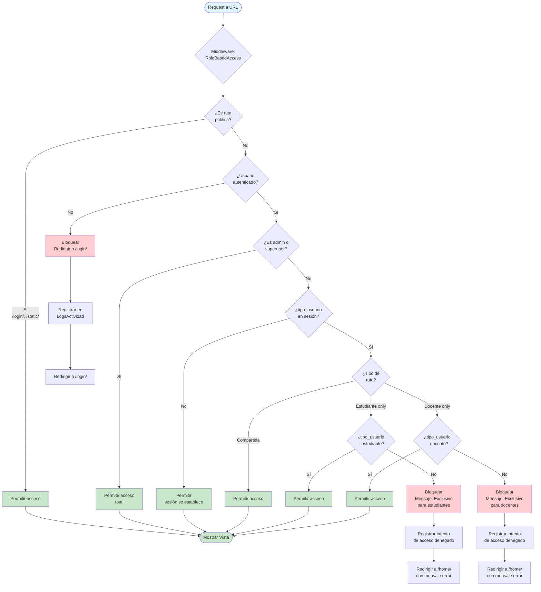
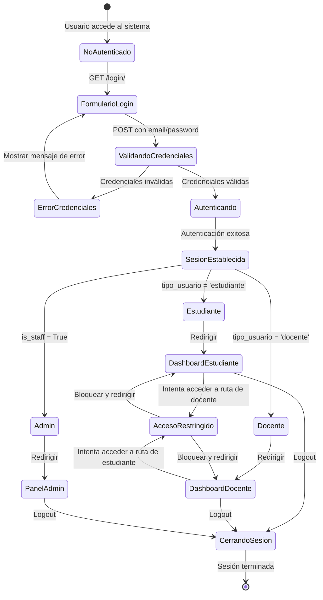
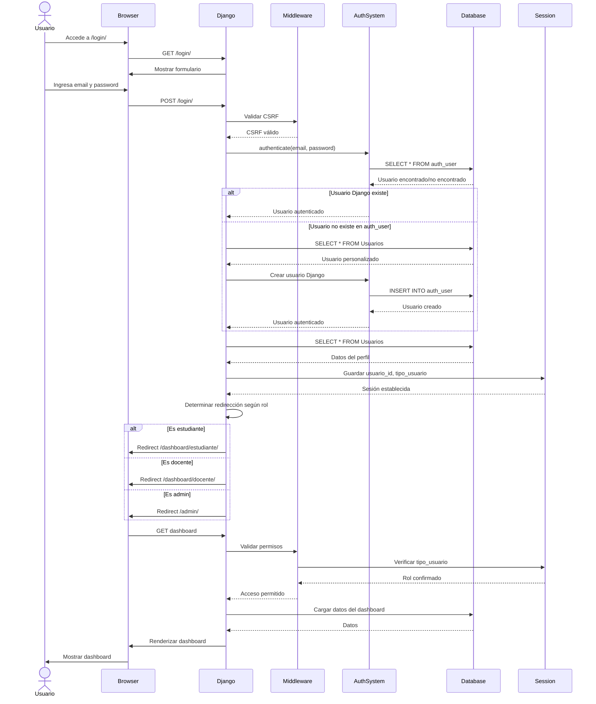
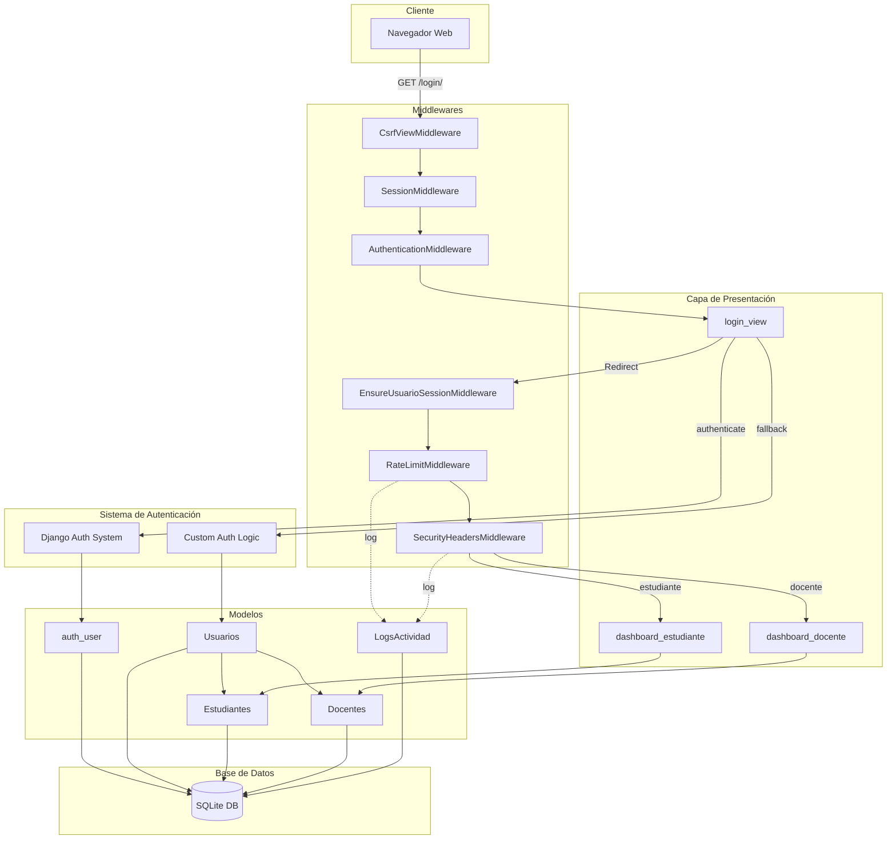

# 📊 DIAGRAMA DE FLUJO - SISTEMA DE INICIO DE SESIÓN

## Diagrama de Flujo Principal

```mermaid
flowchart LR
    Start([Usuario accede a /login/]) --> CheckAuth{¿Usuario ya<br/>autenticado?}
    
    CheckAuth -->|Sí| RedirectDashboard[Redirigir según rol]
    CheckAuth -->|No| ShowForm[Mostrar formulario de login]
    
    ShowForm --> UserInput[Usuario ingresa:<br/>- Email<br/>- Password]
    UserInput --> Submit[Usuario presiona<br/>'Iniciar Sesión']
    
    Submit --> ValidateCSRF{¿CSRF Token<br/>válido?}
    ValidateCSRF -->|No| Error403[Error 403<br/>Forbidden]
    ValidateCSRF -->|Sí| AuthDjango{¿Autenticación<br/>Django exitosa?}
    
    AuthDjango -->|Sí| LoadProfile[Cargar perfil<br/>desde Usuarios]
    AuthDjango -->|No| TryCustomAuth[Intentar autenticación<br/>con tabla Usuarios]
    
    TryCustomAuth --> CheckUser{¿Usuario<br/>existe?}
    CheckUser -->|No| ErrorCred1[Mensaje: Credenciales<br/>inválidas]
    CheckUser -->|Sí| CheckPassword{¿Password<br/>correcto?}
    
    CheckPassword -->|No| ErrorCred2[Mensaje: Credenciales<br/>inválidas]
    CheckPassword -->|Sí| CheckActive{¿Usuario<br/>activo?}
    
    CheckActive -->|No| ErrorInactive[Mensaje: Usuario<br/>inactivo]
    CheckActive -->|Sí| CreateDjangoUser[Crear/actualizar<br/>usuario Django]
    
    CreateDjangoUser --> AuthenticateDjango[Autenticar con<br/>Django auth]
    AuthenticateDjango --> LoadProfile
    
    LoadProfile --> SaveSession[Guardar en sesión:<br/>- usuario_id<br/>- tipo_usuario<br/>- nombre_completo]
    
    SaveSession --> CheckStaff{¿Es staff o<br/>superuser?}
    CheckStaff -->|Sí| RedirectAdmin[Redirigir a /admin/]
    CheckStaff -->|No| CheckRole{¿Tipo de<br/>usuario?}
    
    CheckRole -->|estudiante| RedirectStudent[Redirigir a<br/>/dashboard/estudiante/]
    CheckRole -->|docente| RedirectTeacher[Redirigir a<br/>/dashboard/docente/]
    CheckRole -->|Otro| RedirectHome[Redirigir a /home/]
    
    RedirectAdmin --> Middleware1[Middleware:<br/>EnsureUsuarioSession]
    RedirectStudent --> Middleware1
    RedirectTeacher --> Middleware1
    RedirectHome --> Middleware1
    
    Middleware1 --> Middleware2[Middleware:<br/>RateLimitMiddleware]
    Middleware2 --> Middleware3[Middleware:<br/>SecurityHeaders]
    Middleware3 --> Dashboard([Mostrar Dashboard])
    
    ErrorCred1 --> ShowForm
    ErrorCred2 --> ShowForm
    ErrorInactive --> ShowForm
    Error403 --> ShowForm
    
    style Start fill:#e1f5ff
    style Dashboard fill:#c8e6c9
    style RedirectAdmin fill:#fff9c4
    style RedirectStudent fill:#bbdefb
    style RedirectTeacher fill:#c5cae9
    style ErrorCred1 fill:#ffcdd2
    style ErrorCred2 fill:#ffcdd2
    style ErrorInactive fill:#ffcdd2
    style Error403 fill:#ffcdd2
```

## Diagrama de Validación de Permisos (Después del Login)

## Diagrama de Estados de Usuario

## Diagrama de Secuencia

## Diagrama de Componentes del Sistema

---

## 📝 Descripción de Flujos

### 1. **Flujo Principal de Login**
1. Usuario accede a `/login/`
2. Sistema verifica si ya está autenticado
3. Usuario ingresa credenciales (email + password)
4. Sistema valida CSRF token
5. Intenta autenticación con Django Auth
6. Si falla, intenta con tabla Usuarios personalizada
7. Valida password y estado activo
8. Crea/actualiza usuario Django si es necesario
9. Guarda datos en sesión
10. Redirige según rol (estudiante/docente/admin)

### 2. **Validación de Permisos**
1. Usuario hace request a una URL
2. Middleware verifica si es ruta pública
3. Si no, verifica autenticación
4. Verifica si es admin (acceso total)
5. Verifica tipo de usuario en sesión
6. Valida si la ruta corresponde al rol
7. Permite o bloquea acceso
8. Registra intentos de acceso denegado

### 3. **Roles y Redirecciones**
- **Estudiante** → `/dashboard/estudiante/`
- **Docente** → `/dashboard/docente/`
- **Admin** → `/admin/`

---

## 🎨 Leyenda de Colores

- 🔵 **Azul claro**: Inicio/entrada del flujo
- 🟢 **Verde**: Éxito/acceso permitido
- 🔴 **Rojo**: Error/acceso denegado
- 🟡 **Amarillo**: Admin/casos especiales

---

**Generado el:** 10/11/2025
